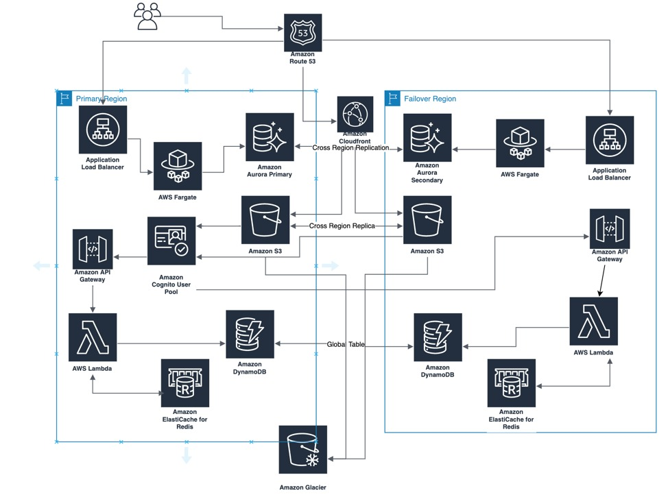
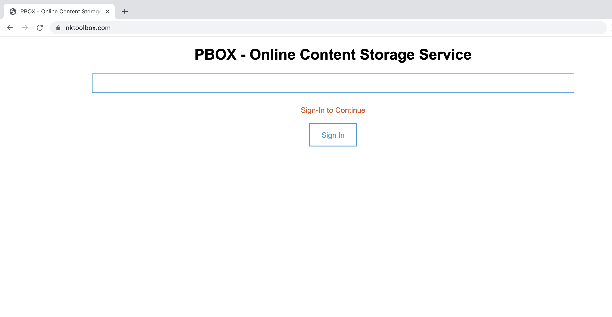
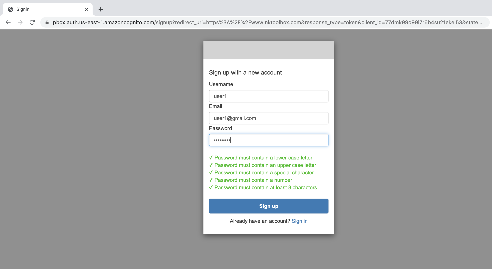
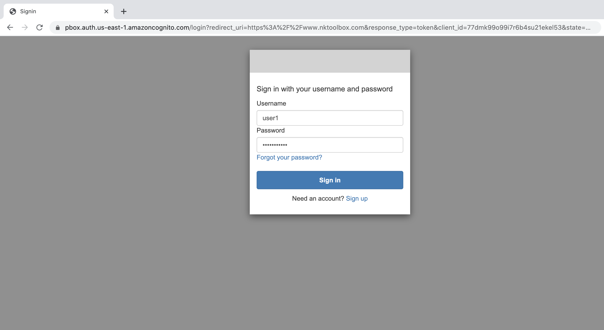
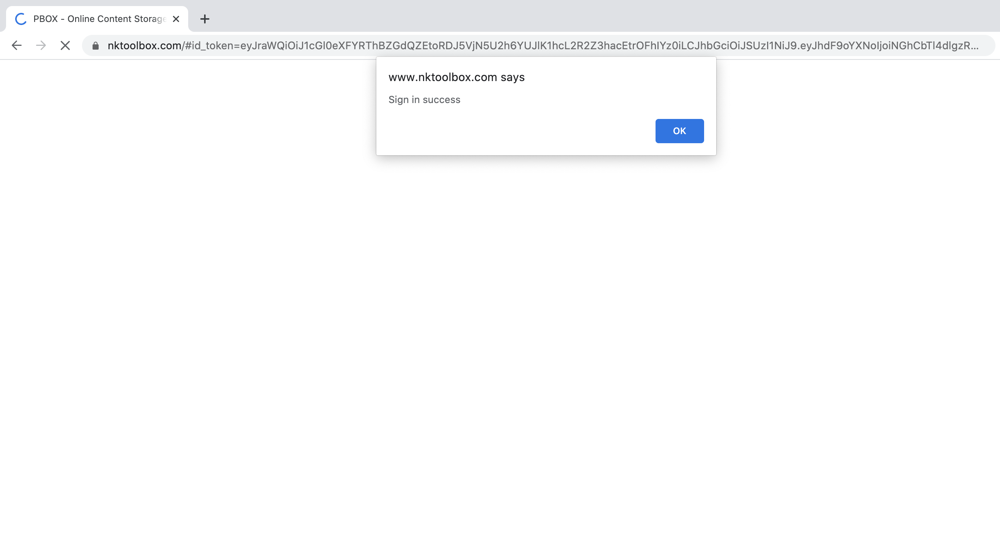
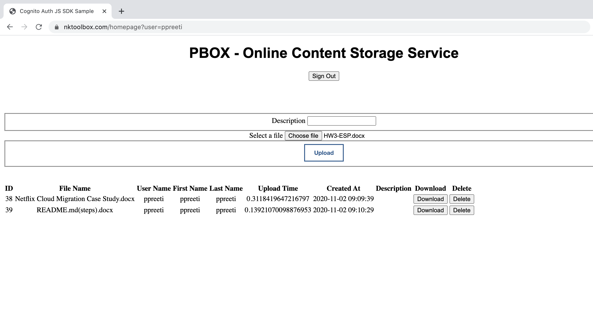

# PBox - Online Content Storage Service

PBox is a cloud base content storage service. User can preserve their content on cloud securely and safely. User would signup with email, username and password. Once sign up process is complete user should receive a verification code on provided email. After email verification user can use the service.

Youtube Video Link: https://youtu.be/Fkxpg-q-5JM

Pbox built upon following technologies:

1. Flask (Python)
2. AWS RDS (MySQL)
3. AWS Cognito
4. AWS Cloud Front
5. AWS EC2 and Fargate
6. AWS ECR
7. AWS Lambda
8. AWS S3 (Transfer acceleration, Archieve, Glacier)
9. AWS Route53

# Architecture

* Multi-region multi zone architecture
* Highly scalable microservice oriented backend 

# Home Page

# Sign-up Page

# Sign-in Page

# Sign-in Success Massage

# Dashboard Upload/Delete/Download Page

